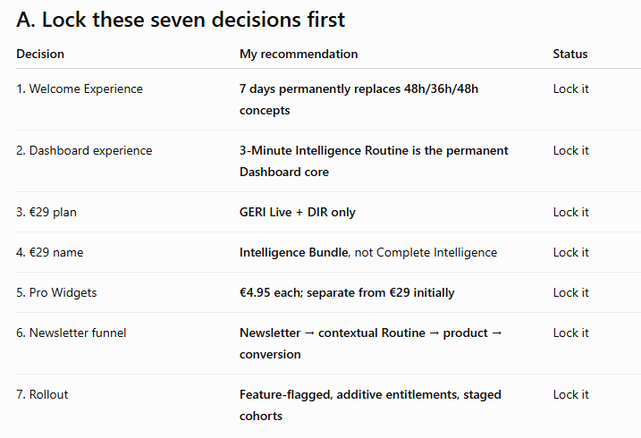
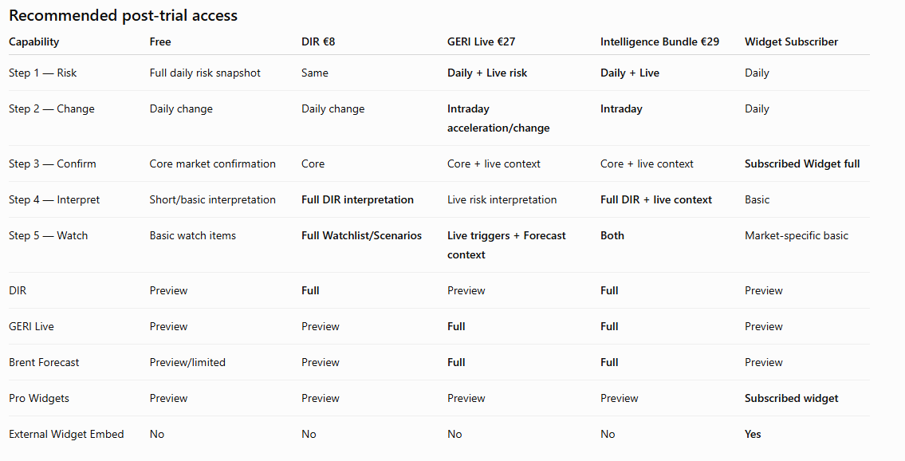
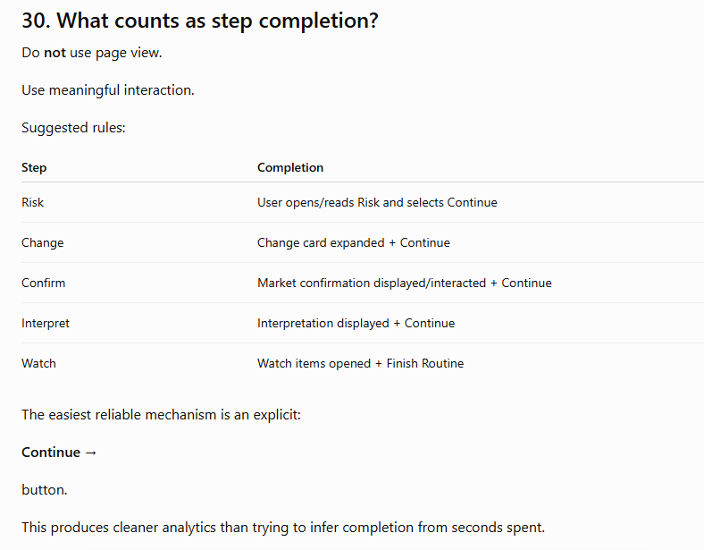
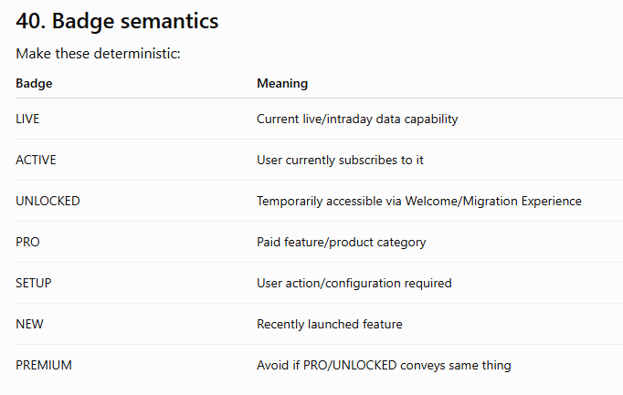
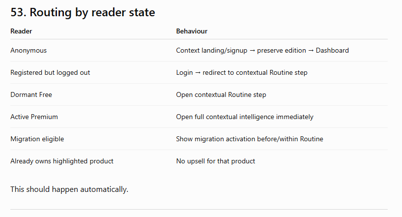

# New Dashboard Implementation Decisions

## Purpose

This document is the implementation-decision companion to [New Dashboard Architecture.md](New%20Dashboard%20Architecture.md). The architecture document describes the strategic model across seven layers; this document records the answers that turn that model into concrete product, entitlement, navigation, funnel, analytics, and rollout rules.

## Implementation position

The New EnergyRiskIQ Dashboard is a daily intelligence workflow, not a collection of product pages. The 3-Minute Intelligence Routine is the permanent Dashboard core, with products adding depth inside the workflow.

The primary implementation decisions are:

- A 7-Day Premium Welcome Experience replaces the former 48-hour/36-hour concepts.
- The €29 product is the EnergyRiskIQ Intelligence Bundle containing GERI Live + DIR only.
- Pro Widgets remain a separate product family at €4.95 each initially.
- Existing subscriptions remain untouched; temporary access is additive.
- Newsletter traffic enters through contextual routines rather than a generic pricing page.
- Rollout is feature-flagged, additive, and staged by cohort.

## Embedded decision tables

The supplied visual tables are embedded next to the corresponding answer sections below. They are implementation references, not replacements for the detailed answers.

## Answer set

Yes. This question set is now detailed enough to turn the previous strategy into a real product architecture and implementation specification. I’m treating the attached document as the working decision framework.

There is one overarching decision I would make before everything else:

The new EnergyRiskIQ Dashboard should not be designed as a collection of products. It should be designed as a daily intelligence workflow.

The products—GERI Live, DIR, Brent Forecast and Pro Widgets—become the engines that add depth to that workflow.

That change is fundamental because it means users learn one habit, rather than having to learn five separate products.

## A. Lock these seven decisions first

Decision	My recommendation	Status
1. Welcome Experience	7 days permanently replaces 48h/36h/48h concepts	Lock it
2. Dashboard experience	3-Minute Intelligence Routine is the permanent Dashboard core	Lock it
3. €29 plan	GERI Live + DIR only	Lock it
4. €29 name	Intelligence Bundle, not Complete Intelligence	Lock it
5. Pro Widgets	€4.95 each; separate from €29 initially	Lock it
6. Newsletter funnel	Newsletter → contextual Routine → product → conversion	Lock it
7. Rollout	Feature-flagged, additive entitlements, staged cohorts	Lock it

I would reserve Complete Intelligence for a future plan containing essentially everything:

GERI Live + DIR + Brent Forecast + all Professional Widgets + possibly Alerts/advanced features.

That future plan could plausibly sit around €34.95–€39.95/month, but I would not launch it yet.

## 1. Core product direction — Q1–Q4
1. Is 7 days definitive?

Yes. Make this a final architectural decision.

Stop referring internally to 36h/48h models after launch.

There should be one concept:

7-Day Premium Welcome Experience

Why seven days is substantially better:

users can experience several different market days;
DIR becomes habitual rather than something they glance at once;
GERI Live gets opportunities to demonstrate intraday changes;
users can encounter different market conditions;
Newsletter traffic can reconnect with the trial;
Day-2, Day-3 and Day-7 behaviour becomes measurable.

The purpose isn't simply to give users seven days of free access.

The purpose is:

Give EnergyRiskIQ enough time to demonstrate a recurring workflow.

2. Is the 3-Minute Routine permanent?

Yes. For every account type.

Free users, DIR subscribers, GERI Live subscribers, Widget subscribers and Bundle subscribers should all see:

1 — Risk → 2 — Change → 3 — Confirm → 4 — Interpret → 5 — Watch

Do not create separate Dashboard architectures for paid users.

What changes is the depth inside the steps.

For example:

Free

Risk → daily GERI/EERI/EGSI snapshot.

GERI Live

Risk → daily + live/intraday risk behaviour.

Same workflow. Different depth.

This is extremely important because if a Free user upgrades, the Dashboard should not suddenly become unfamiliar.

3. Primary Dashboard success objective

Do not optimize the Dashboard directly for subscriptions.

Use this hierarchy:

Primary KPI = First Routine Completion

Secondary = Day-2 return

Tertiary = Premium feature engagement

Commercial = Checkout and paid conversion

So I would define the product funnel as:

Account created → Routine started → Routine completed → Returns tomorrow → Uses premium depth → Encounters locked value → Subscribes

Paid conversion is the business outcome.

Routine completion is the product behaviour that should generate it.

4. Initial target users

Do not optimize simultaneously for everybody.

Primary Dashboard persona:

Energy traders, analysts and professionals who need to understand changing energy-market risk.

Secondary:

risk managers;
energy consultants;
utilities/industrials;
sophisticated market followers.

Website owners are a different job-to-be-done and should primarily encounter that positioning inside the Widgets area.

Newsletter readers are an acquisition source, not a Dashboard persona.

## 2. Premium Experience timing — Q5–Q12

This area should be extremely precise in the database.

5–6. When does it start?

I would not start the seven-day clock simply because /dashboard loaded.

Activation should happen on the first meaningful premium-intent event:

First click on “Start Today’s Routine” OR first opening of any premium capability — whichever happens first.

Therefore:

Login → Dashboard loaded → no activation yet.

Start Today's Routine → activation.

Direct Newsletter deep-link → opens Brent Forecast → activation.

This prevents an accidental login from consuming the experience.

7. Registers but disappears for several days?

No time should be lost.

Status remains:

eligible

rather than:

active

When they return and meaningfully engage:

eligible → active

Then the seven days begin.

You can email them:

Your 7-Day Premium Experience is ready whenever you are.

This is better than:

You registered four days ago, so you only have three days left.

8. Existing-user migration activation

Different rule.

Give existing eligible Free users a 14-day claim window after migration launch.

For example:

Migration launched September 10.

They can activate through September 24.

Once activated:

168 hours Premium Experience.

If they do nothing by September 24:

migration_offer_expired

Do not keep an indefinite migration entitlement hanging around.

Make the 14-day value configurable in Admin.

9. Seven calendar days or exact hours?

Use:

168 exact hours.

If activated:

Monday 18:27 UTC

Expires:

following Monday 18:27 UTC.

This is more defensible and easier to implement.

10. Timezone

Use UTC internally for entitlements.

Never calculate subscription/trial access based upon browser timezone.

Store:

premium_started_at

premium_ends_at

as UTC timestamps.

However, the Daily Routine should not really reset based on midnight at all.

Instead associate it with an:

intelligence_date

or:

intelligence_snapshot_id.

When the new EnergyRiskIQ daily dataset becomes available, a new Routine becomes available.

That avoids weird behaviour where someone gets:

New Daily Routine

while EnergyRiskIQ is still showing yesterday's underlying data.

User timezone should merely control display:

Your Premium Experience ends Monday at 20:27 local time.

11. Event-driven reactivation

Architect for it now.

Do not launch it yet.

Later you could support:

24-Hour Complete Intelligence Pass — Market Shock

for situations such as:

major geopolitical escalation;
GERI regime change;
extreme Brent move;
gas-storage shock;
LNG supply disruption.

The architecture therefore should support generic:

temporary_entitlements

rather than hardcoding everything as welcome_trial.

Possible sources:

welcome_experience

migration_experience

event_pass

promotion

admin_grant

But only Welcome + Migration need to exist in Release 1.

12. One-time per account?

Yes.

Record something like:

welcome_experience_consumed = true

permanent at the identity level.

Changing email should not reset it.

Deleting/recreating an account should ideally not automatically restore it either.

I would avoid aggressive device fingerprinting initially.

Use:

verified user identity;
normalized email;
historical account record;
Stripe customer relationship if one exists.

Perfect prevention of multi-email trial abuse is not worth complicating the first release.

## 3. Definitive entitlement matrix — Q13–Q20

This is probably the most important table in the whole architecture.

Recommended post-trial access
Capability	Free	DIR €8	GERI Live €27	Intelligence Bundle €29	Widget Subscriber
Step 1 — Risk	Full daily risk snapshot	Same	Daily + Live risk	Daily + Live	Daily
Step 2 — Change	Daily change	Daily change	Intraday acceleration/change	Intraday	Daily
Step 3 — Confirm	Core market confirmation	Core	Core + live context	Core + live context	Subscribed Widget full
Step 4 — Interpret	Short/basic interpretation	Full DIR interpretation	Live risk interpretation	Full DIR + live context	Basic
Step 5 — Watch	Basic watch items	Full Watchlist/Scenarios	Live triggers + Forecast context	Both	Market-specific basic
DIR	Preview	Full	Preview	Full	Preview
GERI Live	Preview	Preview	Full	Full	Preview
Brent Forecast	Preview/limited	Preview	Full	Full	Preview
Pro Widgets	Preview	Preview	Preview	Preview	Subscribed widget
External Widget Embed	No	No	No	No	Yes

The principle is:

Free = complete workflow with basic intelligence.

Paid = deeper intelligence.

Do not make Free look like:

Risk ✅
Change 🔒
Confirm 🔒
Interpret 🔒
Watch 🔒

That would destroy the Routine concept.

14. Should €29 include Widgets?

No.

The €29 Intelligence Bundle should be:

GERI Live + DIR

At current standalone pricing:

GERI Live €27
DIR €8

Combined separately = €35.

€29 already represents a very attractive upgrade.

Adding the three €4.95 Widgets would unnecessarily collapse a second monetization category.

15–16. Complete Intelligence or Intelligence Bundle?

Use:

EnergyRiskIQ Intelligence Bundle — €29/month

Reserve:

Complete Intelligence

for the eventual all-access product.

For example eventually:

Complete Intelligence — €34.95/€39.95

GERI Live
DIR
Brent Forecast
WTI Pro
LNG Pro
Storage Pro
advanced Alerts
future premium intelligence.

But do not launch it in Phase 1.

You already have enough product choices to test.

17. Grandfather existing customers?

Yes.

Formal rule:

Existing customers retain their current price while their existing subscription remains continuously active.

If they cancel and later resubscribe, current pricing applies.

I would avoid publicly promising:

Lifetime pricing forever.

Instead call it:

Legacy subscriber pricing.

And—most importantly—migration must never change their Stripe subscription automatically.

18. Upgrade to €29

Use immediate upgrade + Stripe proration.

Example GERI Live user:

€27 → €29 Bundle.

They immediately receive DIR.

Stripe credits unused GERI Live time against the new subscription.

Do not create a second simultaneous €29 subscription.

Their subscription should migrate cleanly.

19. Downgrade

Schedule downgrade for:

end of current billing period

The user keeps Bundle access until then.

Then entitlement becomes whichever plan they chose.

This minimizes refunds, confusion and entitlement bugs.

20. Widgets + Intelligence subscriptions simultaneously?

Yes.

Initially they should be independent.

A customer could have:

GERI_LIVE

plus

LNG_WIDGET

or:

INTELLIGENCE_BUNDLE

plus

ALL_THREE_WIDGETS

Do not force everything into one monolithic subscription yet.

Eventually Complete Intelligence can simplify this for power users.

## 4. Existing-user migration — Q21–Q27
21. User counts

Based on the latest project state, yes:

55 registered users

consisting of approximately:

53 Free + 1 GERI Live + 1 DIR.

Take a fresh database snapshot immediately before migration rather than hardcoding those cohort counts.

22. Existing Free users

Give them exactly the same premium capabilities as new registrations.

But different messaging.

New user:

Welcome to EnergyRiskIQ. Explore your Premium Intelligence Experience.

Existing user:

EnergyRiskIQ has changed. Explore the new Intelligence Dashboard with 7 days of premium access.

That difference matters.

You are not pretending they're newly registered.

23–24. Existing GERI/DIR customers

I would not automatically start their complementary seven days.

Instead:

GERI subscriber sees:

Explore DIR free for 7 days — your existing GERI Live subscription remains unchanged.

DIR subscriber sees:

Explore GERI Live + Brent Forecast free for 7 days — your DIR subscription remains unchanged.

They click:

Activate complimentary access

Then their seven days begin.

This prevents consuming their opportunity when they are not paying attention.

25. Can they opt out?

Yes.

Just allow:

Not now / dismiss

Their existing paid product is completely unaffected.

No subscription modifications.

No cancellation implications.

26. Migration communication

Use both Dashboard and email.

Email creates awareness.

Dashboard performs activation.

Do not activate the experience from an email click until they actually reach authenticated EnergyRiskIQ and interact.

27. Rollback architecture

This is critical:

Premium Experiences must be additive entitlement records. They must never modify the underlying paid subscription entitlement.

Think:

Paid entitlements
+
Temporary entitlements

Effective access

Example:

DIR subscriber has:

DIR = subscription

Temporary migration adds:

GERI_LIVE = migration_experience

Seven days later only the second record expires.

DIR remains untouched.

That architecture makes rollback dramatically safer.

## 5. Dashboard Routine behaviour — Q28–Q35

28. Single view or multi-screen?

Single Dashboard view with expandable steps.

Do not make users click through five pages.

Desktop:

Five stacked intelligence sections.

Mobile:

Accordion.

Something like:

TODAY'S 3-MINUTE INTELLIGENCE

✓ 1 Risk
✓ 2 Change
→ 3 Confirm
○ 4 Interpret
○ 5 Watch

The currently active step expands.

29. Can users jump?

Yes.

Default behaviour should encourage:

1 → 2 → 3 → 4 → 5

But an advanced user must be able to click directly:

GERI Live
DIR
Brent Forecast
WTI Widget.

The Routine should organize EnergyRiskIQ.

It should not imprison the user.

30. What counts as step completion?

Do not use page view.

Use meaningful interaction.

Suggested rules:

Step	Completion
Risk	User opens/reads Risk and selects Continue
Change	Change card expanded + Continue
Confirm	Market confirmation displayed/interacted + Continue
Interpret	Interpretation displayed + Continue
Watch	Watch items opened + Finish Routine

The easiest reliable mechanism is an explicit:

Continue →

button.

This produces cleaner analytics than trying to infer completion from seconds spent.

31. Routine reset

Do not reset at browser midnight.

Reset when a new EnergyRiskIQ intelligence snapshot is published.

So:

routine_id = intelligence_date

If no new intelligence dataset exists, yesterday's Routine remains today's latest available intelligence rather than pretending there's something new.

32. What Free sees when premium expires

Use progressive depth reduction, not hard blank screens.

Example GERI Live:

Free can see:

GERI current daily level
regime
daily change

Premium section shows:

Intraday risk acceleration

GERI Live tracks how risk is changing throughout the session.

[Unlock GERI Live]

DIR:

Show:

one-line summary
maybe first insight

Then:

Full interpretation, scenarios and watchlist available in DIR.

Widgets:

Show rendered mini-preview or limited current state.

Then lock advanced intelligence/configuration.

33. Hard sales-message rule

I would implement:

Maximum one primary commercial message visible in the Dashboard at any time.

Additionally:

contextual locked-state messaging is allowed inside the currently opened step;
no more than one upgrade CTA above the fold;
collapsed steps can show subtle PREMIUM indicators but not full advertisements;
never stack multiple banners.

This dramatically improves perceived quality.

34. Banner priority

Use this order:

Critical operational/service issue → billing/account action → Premium Experience expiry → onboarding/routine → contextual upgrade → marketing campaign

For example:

System outage overrides everything.

Payment failure overrides promotional offer.

“Premium access ends tomorrow” overrides generic GERI Live advertisement.

35. No €29 offer after first Routine?

Correct. I would make this a rule.

After first completion show:

Today's intelligence complete. Come back tomorrow to see what changed.

This is a major strategic point.

On Visit 1 you're selling the habit.

On Visit 2+ you're allowed to begin selling the product.

Exception:

If the user explicitly tries to access a locked feature, of course show its upgrade option.

## 6. Navigation — Q36–Q42

I would actually change one earlier recommendation.

36. Final widget category

Use:

MARKET TOOLS

rather than PROFESSIONAL WIDGETS.

Why?

Navigation should describe what something is for, not whether you must pay.

Then:

WTI Intelligence PRO
LNG Intelligence PRO
Gas Storage Intelligence PRO

This is cleaner than:

Professional Widgets
→ three paid things.

PRO badges provide the commercial state.

37. Brent Forecast

Make it a permanent sidebar item under Intelligence.

Do not bury it inside GERI Live.

For example:

INTELLIGENCE

GERI Live
Daily Intelligence Report
Brent Forecast
Alerts

Why?

Because Brent Forecast is:

independently understandable;
highly promotable;
valuable in Newsletter editions;
capable of receiving direct deep links.

It can still technically be an entitlement of GERI Live.

38. Alerts

Keep under:

INTELLIGENCE

for now.

Do not create MY INTELLIGENCE until you actually have several personalization tools such as:

Alerts
Saved markets
Saved scenarios
Watchlists
Saved presets.

Avoid premature navigation categories.

39. Expanded sections

Yes:

Dashboard and Intelligence expanded by default.

Market Tools and secondary areas can collapse.

40. Badge semantics

Make these deterministic:

Badge	Meaning
LIVE	Current live/intraday data capability
ACTIVE	User currently subscribes to it
UNLOCKED	Temporarily accessible via Welcome/Migration Experience
PRO	Paid feature/product category
SETUP	User action/configuration required
NEW	Recently launched feature
PREMIUM	Avoid if PRO/UNLOCKED conveys same thing

Avoid having:

PRO PREMIUM UNLOCKED NEW

beside one navigation item.

One or maximum two badges.

41. NEW badge

Best rule:

Feature launch timestamp + 21 days OR until first meaningful use, whichever comes first.

Admin should be able to turn it off.

Do not leave NEW badges for six months.

42. Routine in sidebar?

No.

Today's Routine belongs only in the Dashboard.

The Routine is the operating system of the Dashboard.

It is not another product.

## 7. Pro Widgets — Q43–Q50
43. €4.95 each?

Yes. I would launch all three at €4.95/month.

The consistency is valuable:

WTI — €4.95
LNG — €4.95
Gas Storage — €4.95

Much better than different tiny prices requiring customers to compare €3.95 vs €4.95 vs €5.95.

44. €9.95 pack immediately?

No.

Launch individual widgets first.

Why?

You need to learn what people actually value.

You already have:

DIR €8
GERI Live €27
Bundle €29
Widgets €4.95

Adding another €9.95 choice immediately increases pricing complexity.

Once users demonstrate cross-widget demand, add:

Market Tools Pack — €9.95/month

Later.

45. Widgets during seven days?

Yes—but with one qualification.

Unlock all three for use inside EnergyRiskIQ.

Do not give temporary users unrestricted external embed licensing.

This means the welcome experience demonstrates:

market insight
interaction
history
signals
“What Changed?”

But external publishing remains a paid professional utility.

46. Research versus embedding

Their primary product identity inside EnergyRiskIQ should be research/intelligence tools.

Embedding is an additional professional benefit.

Positioning:

Use the intelligence yourself — or publish it on your own website.

If you position them principally as website widgets, your traders may assume they're irrelevant.

47. €4.95 license

Recommended:

One subscription permits use inside EnergyRiskIQ plus embedding on domains owned or operated by the subscriber.

Do not permit:

agency customer websites
resale
white-label redistribution
unlimited third-party installations.

Those become:

Agency / Publisher / Enterprise license

later.

48. Domain controls?

If external embedding is part of the €4.95 product:

Yes. Minimal domain controls are required.

At minimum:

Allowed Domain
Embed Code
Enable/Disable Embed

Otherwise you have almost no way of enforcing the license you are selling.

Full analytics can wait.

49. Widget improvement priority

There are two different priorities.

Product value first:

What Changed?
Storage injection/withdrawal pace
LNG competition/tightness signal
WTI spread/trend intelligence
Saved Presets

Publishing infrastructure:

Allowed Domains
Embed Management
Usage Analytics

What Changed? is the biggest strategic improvement because it moves the widget from:

data display

to:

intelligence product.

50. Usage should affect offers?

Absolutely.

Example:

User repeatedly uses LNG and nothing else.

Do not immediately say:

Buy €29 Intelligence Bundle.

Say:

Keep LNG Intelligence unlocked — €4.95/month.

If they repeatedly use:

GERI Live + DIR + Brent Forecast

offer:

Intelligence Bundle — €29/month.

If they repeatedly use two or three Widgets:

eventually offer:

Market Tools Pack.

This is one of the easiest personalization wins available.

## 8. LinkedIn Newsletter funnel — Q51–Q60

This becomes:

LinkedIn → curiosity → EnergyRiskIQ context → Routine → intelligence depth → habit → subscription

rather than:

LinkedIn → pricing → buy.

51. Is the primary CTA always the Routine?

Make it the default CTA, not an absolute law.

Roughly 80–90% of Editions could use:

Run Today's 3-Minute Energy Intelligence Routine

But contextual wording is better.

An LNG issue could use:

See What Today's LNG Signals Are Confirming

and deep-link directly into Step 3.

Architecturally both lead into the Routine.

52. Newsletter → Pricing?

Normally no.

Pricing is too large a leap from editorial content.

The preferred sequence is:

Newsletter
→ intelligence experience
→ premium value
→ pricing.

You can occasionally link pricing in an explicitly commercial announcement, but not as standard Newsletter behaviour.

53. Routing by reader state

Reader	Behaviour
Anonymous	Context landing/signup → preserve edition → Dashboard
Registered but logged out	Login → redirect to contextual Routine step
Dormant Free	Open contextual Routine step
Active Premium	Open full contextual intelligence immediately
Migration eligible	Show migration activation before/within Routine
Already owns highlighted product	No upsell for that product

This should happen automatically.

54. Newsletter metadata

Every link should carry at least:

source=linkedin_newsletter

edition_id

topic_id

entry_step

featured_product

Optionally:

cta_variant

content_section

You can still use standard UTM fields for external analytics.

Internally, use proper IDs instead of relying entirely on UTMs.

55. Attribution persistence

Store three things separately.

Immutable first touch

Where did this user originally come from?

Keep for lifetime.

Last meaningful touch

Which content brought them back?

Continuously update.

Conversion attribution

Which Newsletter edition contributed to subscription?

I would use a 30-day attribution window initially.

Then report:

Edition → registrations
Edition → routines
Edition → Premium activations
Edition → subscriptions
Edition → revenue.

56. Direct contextual deep-link?

Yes.

This is a very powerful part of the architecture.

For example Newsletter:

Europe’s Storage Refill Pace Is Slowing

CTA could land at:

Dashboard → Step 3 Confirm → Gas Storage context

instead of generic Dashboard home.

User still sees the overall 1–5 Routine and can continue from there.

57. Newsletter Intelligence Companion

Available to both Free and Paid.

Free:

short context
key number
basic explanation.

Paid:

dynamic deeper interpretation
relevant DIR insight
GERI Live context
Forecast/Widget output.

The Free Companion becomes another conversion bridge.

58. Featured product selection

Start manual/editorial.

For each Edition define:

Primary routine step
Featured product
Optional secondary product.

Your 52-week editorial calendar already gives you the basis for this.

Later automate mapping.

Do not build AI/rules before you have enough performance history.

59. Pro Widgets in Newsletter?

Yes.

This is one of the best uses for them.

Use them as:

evidence

rather than:

advertising.

For example:

European storage is currently X%.

Then show a real Storage Widget visualization.

Underneath:

Data: EnergyRiskIQ Gas Storage Intelligence.

This demonstrates product quality without interrupting the article.

60. CTA limit?

Make it an editorial rule:

One primary CTA per Newsletter. Maximum one contextual secondary CTA.

No six buttons.

No:

Try GERI
Try DIR
View Forecast
Try LNG
Try WTI
See pricing.

One clear next action dramatically improves funnel interpretation too.

## 9. Personalization — Q61–Q65
61. Rules-based first?

Yes.

Absolutely no need for sophisticated ML here.

A simple interest system is enough.

Example:

geri_interest

dir_interest

brent_forecast_interest

lng_widget_interest

wti_widget_interest

storage_widget_interest

62. Meaningful interest threshold

One page view is not enough.

I would consider interest meaningful when any of these occur:

product opened on two different sessions;
product interacted with meaningfully;
feature opened repeatedly during Premium Experience;
Forecast simulation run;
Widget configuration used;
DIR sections expanded/read repeatedly.

You can eventually implement a simple score:

Page open = 1
Meaningful interaction = 2
Return another day = 3
Completed core product action = 3

When:

interest_score >= 4

product becomes eligible for contextual promotion.

63. Highest interest or highest commercial value?

Interest wins.

Never sacrifice relevance just because €29 generates more revenue.

Someone who repeatedly uses only LNG is much more likely to pay €4.95 than €29.

But there is an important rule:

If interest spans multiple premium intelligence products, then bundle becomes relevant.

Examples:

LNG only → LNG €4.95

GERI only → GERI Live

DIR only → DIR

GERI + DIR → €29 Bundle

GERI + Forecast + DIR → €29 Bundle

WTI + LNG + Storage → future Widget Pack.

64. Existing paid subscriber banners

Correct.

No generic:

Start your Premium Experience!

banner for paying subscribers.

They already converted.

Instead:

GERI subscriber receives contextual DIR opportunities.

DIR subscriber receives contextual GERI Live opportunities.

Bundle subscriber should receive essentially no generic commercial messaging except Widgets or genuinely new capabilities.

65. Dismissed offers

Recommended:

Dismiss standard offer → suppress 7 days.

Explicit:

Not interested

→ suppress 30 days.

A major context change can override suppression—for example, trial expiry tomorrow or a completely different product becoming relevant.

Also cap generic upgrade impressions.

Seeing the same upgrade banner on every login quickly makes EnergyRiskIQ feel cheap.

## 10. Analytics — Q66–Q71
66. Primary activation KPI

Yes:

% of registered users who complete their first 3-Minute Routine

But measure it within defined periods.

I would track:

First Routine Completion within 24h

and:

within 72h

separately.

67. Mandatory v1 events

Your proposed list is correct. I would add several critical events.

Acquisition

Newsletter Viewed/Clicked
Landing Viewed
Signup Started
Signup Completed
Login Completed

Activation

Dashboard First Viewed
Premium Experience Eligible
Premium Experience Started
Routine Started
Step Viewed
Step Completed
Routine Completed

Engagement

GERI Live Opened
DIR Opened
Forecast Opened
Forecast Run
Widget Opened
Widget Interaction
Locked Feature Encountered

Retention

D2 Return
D3 Return
D7 Return

Conversion

Offer Viewed
Offer Clicked
Offer Dismissed
Pricing Viewed
Checkout Started
Checkout Completed
Subscription Started
Subscription Upgraded
Subscription Cancelled

Also record:

product_id

source

edition_id

routine_step

where relevant.

68. Anonymous → registered attribution

Create an anonymous:

visitor_id

on first EnergyRiskIQ visit.

Store attribution server-side/first-party where possible.

When signup occurs:

visitor_id → user_id

Then all preceding Newsletter touches can be attached to the account.

When an existing user logs in:

associate the current session's attribution with their existing user_id.

Do not depend exclusively on LinkedIn referral headers.

69. Successful Newsletter outcome

Don't choose only one.

Use a hierarchy:

Primary editorial outcome

Routine completion

Acquisition outcome

Account creation

Product outcome

Premium feature engagement

Commercial outcome

Subscription

Business outcome

Revenue attributed to Edition

So an Edition can be excellent at acquisition even if conversion happens three weeks later.

70. Validation with 55 accounts

With only 55 accounts, don't pretend you have statistically robust A/B-test data.

Use it as product validation.

I would consider the first migration encouraging if roughly:

≥25% of contacted Free users start the Routine;
≥60% of starters finish it;
≥30% of completers return on Day 2;
multiple users intentionally revisit Premium features;
at least 2 net-new paid conversions emerge from the cohort.

Those aren't universal industry benchmarks.

They're practical internal thresholds for deciding whether the architecture is producing behaviour worth scaling.

Most importantly:

53 Free accounts are sufficient to find serious UX problems.

They're not sufficient to precisely determine whether your true conversion rate is 4.2% versus 6.1%.

71. Product failure vs sales failure

Your event instrumentation should answer this.

Scenario A

Routine completion high
Premium feature usage low

→ Discovery/product relevance problem.

Scenario B

Premium usage high
Locked-feature encounters high
Offer clicks low

→ Positioning/offer problem.

Scenario C

Offer clicks high
Pricing views high
Checkout starts low

→ Pricing/value objection.

Scenario D

Checkout starts high
Checkout completion low

→ Checkout/billing friction.

Scenario E

Subscription high
Cancellation quickly follows

→ Product retention/value problem.

Scenario F

Signup high
Routine-start low

→ Onboarding problem.

This is exactly why analytics must be built at the same time as the new Dashboard—not afterward.

## 11. Rollout and operational safety — Q72–Q75
72. Rollout order

I would slightly improve your proposed sequence.

Stage 0 — Internal/Admin testing

Your own test accounts.

Stage 1 — Existing paying users

The current GERI Live and DIR subscriber.

Test cross-product temporary entitlements without touching billing.

Stage 2 — Small Free cohort

Approximately 10 existing Free users.

Observe:

activation
UI
expiry
deep links
analytics.

Stage 3 — Remaining existing Free users

Roll out migration to the rest.

Stage 4 — New registrations

Make the seven-day Welcome Experience permanent.

Stage 5 — Newsletter traffic

Start routing LinkedIn traffic into the contextual Routine.

Stage 6 — Personalization

Interest scoring and dynamic offers.

That is safer than exposing all 53 Free accounts immediately after testing only two paid accounts.

73. Feature flags?

100% yes.

At minimum:

new_dashboard_enabled

routine_enabled

welcome_experience_enabled

migration_experience_enabled

premium_widgets_preview_enabled

newsletter_deeplink_enabled

personalized_offers_enabled

widget_embed_enabled

Ideally flags can target:

admin
specific user
cohort
percentage rollout
all users.

74. What must be tested?

Before rollout, create a proper entitlement test matrix.

Especially:

Free → Welcome → Expired Free

DIR → Migration → Expired DIR

GERI → Migration → Expired GERI

GERI → Bundle upgrade

DIR → Bundle upgrade

Bundle → downgrade

Widget → Intelligence subscription

Newsletter anonymous → signup → contextual Dashboard

Newsletter existing user → login → contextual Dashboard

And explicitly test:

Stripe subscription unchanged
temporary access expiry
access restoration
browser refresh
mobile
expired tokens
multiple devices
timezone display
deep links
dismissed banners
cancellation
failed payment.

75. Admin configuration vs hardcoded rules

This distinction is important.

Admin configurable

Premium Experience duration
Migration activation deadline
Banner copy
Banner start/end date
Feature flags
NEW badge period
Offer suppression duration
Newsletter Edition mappings
Edition → Step mapping
Edition → Featured Product mapping
Widget pack availability
event-driven passes later.

Stripe/product configuration

Prices
Stripe price IDs
billing interval
product mapping.

Display pricing should come from the product configuration/Stripe mapping rather than being scattered through frontend code.

Version-controlled product logic

Entitlement matrix
Routine architecture
entitlement precedence
completion semantics
security/license rules.

Those should not be casually editable through an Admin screen.

Otherwise an accidental Admin change could give or revoke customer entitlements.

## The entitlement architecture I would build

Underneath everything, I would separate subscriptions from access.

Think of it as four layers:

SUBSCRIPTIONS
GERI Live
DIR
Intelligence Bundle
Widget WTI
Widget LNG
Widget Storage

        ↓

TEMPORARY ENTITLEMENTS
Welcome Experience
Migration Experience
Future Event Pass

        ↓

EFFECTIVE ENTITLEMENTS
Can view GERI Live?
Can open DIR?
Can use Forecast?
Can use LNG Widget?
Can embed LNG Widget?

        ↓

DASHBOARD PRESENTATION
ACTIVE
UNLOCKED
PRO
Preview
Locked
CTA

The Dashboard should never ask Stripe directly:

Is this person allowed to show Step 4?

It should ask your entitlement layer:

Does this user currently have dir_full_access?

And the entitlement service decides whether that access comes from:

subscription
Bundle
Welcome Experience
Migration Experience
admin grant.

This will save you enormous problems later.

### One important distinction for the 7-Day Experience

I would call what the user receives:

Premium Intelligence Experience

rather than:

Free Trial of the €29 plan.

Because it is not actually a trial of one particular subscription.

During those seven days you're proposing to let them explore:

GERI Live
DIR
Brent Forecast
WTI
LNG
Gas Storage.

Yet there is no identical €29 post-trial product containing all those features.

So don't create the expectation:

Everything I'm currently using costs €29.

Instead:

Your Premium Intelligence Experience unlocks EnergyRiskIQ's advanced intelligence so you can discover what is most valuable to you.

Then the system observes usage and recommends the appropriate product.

This makes the personalization strategy logically coherent.

## The resulting Dashboard architecture

The final structure I would now work toward is approximately:

ENERGYRISKIQ

DASHBOARD
  Today

INTELLIGENCE
  GERI Live              LIVE / ACTIVE / UNLOCKED
  Daily Intelligence
  Brent Forecast
  Alerts

MARKET TOOLS
  WTI Intelligence       PRO
  LNG Intelligence       PRO
  Gas Storage            PRO

ACCOUNT
  Subscription
  Preferences

And the Dashboard itself becomes:

Good morning

TODAY'S ENERGY INTELLIGENCE
Saturday, 29 August

Your 3-Minute Intelligence Routine
─────────────────────────────────

1. WHAT'S HAPPENING TO RISK?
   GERI / EERI / EGSI

2. IS RISK ACCELERATING?
   Daily change / GERI Live

3. ARE MARKETS CONFIRMING IT?
   Brent / WTI / TTF / LNG / Storage

4. WHAT DOES IT MEAN?
   Interpretation / DIR

5. WHAT SHOULD I WATCH NEXT?
   Watchlist / scenarios / signals

─────────────────────────────────

Today's Routine: 3 / 5 complete
Continue →

That's dramatically stronger than a Dashboard whose main purpose is showing a collection of cards and subscription banners.

### And the Newsletter now fits naturally

The architecture becomes a closed loop:

LinkedIn Newsletter

“Europe's Storage Refill Pace Is Starting to Matter”

↓

CTA

“See What Today's Market Signals Are Confirming”

↓

EnergyRiskIQ Dashboard — Step 3

Gas storage + TTF + LNG context already expanded

↓

User continues:

Step 4 — Interpret

↓

DIR provides deeper explanation

↓

Step 5 — Watch

↓

User finishes Routine

↓

Today's intelligence complete.
Come back tomorrow to see what changed.

↓

Day 2

↓

User encounters deeper premium value again

↓

Only then:

Continue with the intelligence you use most.

↓

DIR €8
LNG €4.95
GERI Live €27
or
Intelligence Bundle €29

This is the funnel I would build.

It changes the commercial question from:

“How do we convince a Free user to buy GERI Live?”

to:

“How do we make the user rely on EnergyRiskIQ for three minutes every day—and then make losing the premium depth feel painful?”

That is a much stronger subscription architecture.

## Implementation handoff

The next logical step is now to turn these decisions into the exact New Dashboard Information Architecture: component-by-component, including what appears above the fold, what each of the five Routine steps contains for Free vs Premium users, where the existing Dashboard cards move, the exact left-navigation structure, the seven-day banner states, expired-state UI, and the conversion surfaces.
